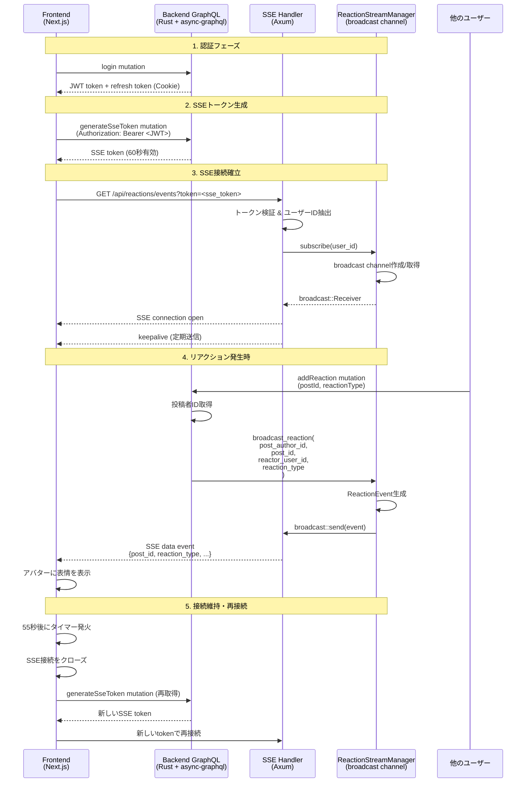

# Echo - 承認欲求ゼロの気軽SNS

投稿者が自分の投稿を確認できない、承認機能のない匿名SNSアプリケーション。

## 目次

- [コンセプト](#コンセプト)
- [技術スタック](#技術スタック)
- [プロジェクト構造](#プロジェクト構造)
- [セットアップ](#セットアップ)
- [GraphQL API](#graphql-api)
  - [認証フロー](#認証フロー)
  - [クエリ](#クエリ)
  - [ミューテーション](#ミューテーション)
- [データベーススキーマ](#データベーススキーマ)
- [アーキテクチャ](#アーキテクチャ)
- [開発](#開発)
- [SSE（Server-Sent Events）](#sseserver-sent-eventsでリアルタイムリアクション通知)
- [トークンの仕組み](#トークンの仕組み)
- [フロントエンド向け実装ガイド](#フロントエンド向け実装ガイド)

## コンセプト

- ✅ 投稿者は自分の投稿を確認できない
- ✅ 「いいね」やフォローなどの承認機能は一切なし
- ✅ 名前・プロフィール画像はランダム
- ✅ 投稿は100回表示されたら自動削除
- ✅ 他人の投稿はランダムに閲覧可能

## 技術スタック

### バックエンド
- **言語**: Rust
- **フレームワーク**: Axum
- **GraphQL**: async-graphql
- **ORM**: SeaORM
- **データベース**: PostgreSQL
- **アーキテクチャ**: クリーンアーキテクチャ + DDD

### フロントエンド (Web)
- **フレームワーク**: Next.js 14 (App Router)
- **言語**: TypeScript
- **スタイリング**: Tailwind CSS
- **UIコンポーネント**: shadcn/ui
- **GraphQL**: Apollo Client

### フロントエンド (Android)
- **言語**: Kotlin
- **UIフレームワーク**: Jetpack Compose
- **GraphQL**: Apollo Kotlin
- **アーキテクチャ**: MVVM

## プロジェクト構造

```
echo/
├── backend/           # Rust + GraphQL バックエンド
│   ├── src/
│   │   ├── domain/           # ドメイン層
│   │   ├── application/      # アプリケーション層（ユースケース）
│   │   ├── infrastructure/   # インフラ層（リポジトリ実装）
│   │   └── presentation/     # プレゼンテーション層（GraphQL API）
│   └── migration/     # データベースマイグレーション
├── frontend/          # Next.js Webフロントエンド
│   └── src/
│       ├── app/              # Next.js App Router
│       ├── components/       # Reactコンポーネント
│       └── lib/              # ユーティリティ
└── android/           # Android アプリ
    └── app/src/main/
        ├── java/             # Kotlinコード
        └── graphql/          # GraphQLスキーマとクエリ
```

## セットアップ

### 前提条件

- [Docker Desktop](https://www.docker.com/products/docker-desktop/) がインストールされていること

### 起動手順

```bash

# 1. すべてのサービスを起動（初回はビルドに数分かかります）
make up

# 2. シードデータを挿入
make seed
```

**完了！** 以下にアクセスできます：

- **フロントエンド**: http://localhost:3000
- **GraphQL Playground**: http://localhost:8000
- **GraphQL API**: http://localhost:8000/graphql

### テストユーザー

以下のユーザーでログインできます（パスワードはすべて `password123`）：

- alice
- bob
- charlie
- diana
- eve

### よく使うコマンド

```bash
# サービス起動・停止
make up           # すべてのサービスを起動
make down         # すべてのサービスを停止
make restart      # すべてのサービスを再起動

# ログ確認
make logs         # すべてのログを表示
make logs SERVICE=backend    # バックエンドのログのみ表示
make logs SERVICE=frontend   # フロントエンドのログのみ表示

# データベース
make seed         # テストデータを挿入
make seed-reset   # DBをリセットしてテストデータを再挿入
make db           # PostgreSQLに接続

# その他
make test         # テストを実行
make rebuild      # クリーンビルドして再起動
make help         # すべてのコマンドを表示
```

### 開発時のポイント

- **コードの自動反映**: バックエンド・フロントエンドのコードを変更すると自動的に再起動・反映されます
- **データベースリセット**: `make seed-reset` でデータベースをクリーンな状態に戻せます
- **ログ監視**: `make logs` でリアルタイムにログを確認できます（Ctrl+Cで終了）

## GraphQL API

### 認証フロー

#### 1. ユーザー登録

```graphql
mutation {
  signup(username: "太郎", password: "password123", avatarUrl: null) {
    accessToken
    userId
  }
}
```

- レスポンスで `accessToken` を取得
- `refreshToken` は自動的に HttpOnly Cookie に保存される

#### 2. ログイン

```graphql
mutation {
  login(username: "太郎", password: "password123") {
    accessToken
    userId
  }
}
```

#### 3. トークンリフレッシュ

```graphql
mutation {
  refreshToken {
    accessToken
  }
}
```

- Cookie から自動的に `refreshToken` が送信される
- 新しい `accessToken` を取得

### クエリ

#### タイムライン取得

```graphql
query {
  timeline(limit: 10) {
    id
    content
    imageUrl
    authorName
    authorAvatar
  }
}
```

**要認証**: `Authorization: Bearer <accessToken>` ヘッダーが必要

- 自分の投稿は表示されない
- 表示回数100未満の投稿のみランダム順で取得

#### ユーザーの表情状態を取得

```graphql
query {
  userExpressionState {
    dominantExpression
    intensity
    reactionCounts {
      reactionType
      count
    }
    totalReactions
  }
}
```

**要認証**: 自分が受け取ったリアクションから3Dアバターの表情を計算

**新機能**: 表情のブレンディング
- `expressionWeights` フィールドは、各リアクションタイプの割合を返します
- 例: `[{ reactionType: "LAUGH", weight: 0.6 }, { reactionType: "EMPATHY", weight: 0.4 }]`
- フロントエンドでは、これらの重みを使って複数の表情を同時に表現できます
- 60%の笑いと40%の共感のような、微妙な感情のブレンドが可能です

#### ユーザーの最新リアクションを取得

```graphql
query {
  userLatestReaction(userId: "uuid") {
    # SURPRISE | EMPATHY | LAUGH | SAD | CONFUSED
  }
}
```

### ミューテーション

#### 投稿作成

```graphql
mutation {
  createPost(input: {
    content: "Hello, Echo!"
    imageUrl: null
  })
}
```

**要認証**: JWT トークンから投稿者を特定

#### 投稿の表示回数をインクリメント

```graphql
mutation {
  incrementDisplayCount(postId: "uuid")
}
```

- 100回表示されると自動削除

#### リアクション追加

```graphql
mutation {
  addReaction(
    postId: "uuid"
    reactionType: LAUGH
  )
}
```

**要認証**: リアクション種類: `SURPRISE` | `EMPATHY` | `LAUGH` | `SAD` | `CONFUSED`

#### リアクション削除

```graphql
mutation {
  removeReaction(
    postId: "uuid"
    reactionType: LAUGH
  )
}
```

**要認証**

#### SSE トークン生成

```graphql
mutation {
  generateSseToken
}
```

**要認証**: SSE接続用の短命トークン（60秒有効）を取得

## データベーススキーマ

### users テーブル

| カラム名 | 型 | 説明 |
|---------|---|------|
| id | UUID | ユーザーID（主キー） |
| display_name | String | ユーザー名（ユニーク、ログインID） |
| avatar_url | String | アバターURL（3Dモデル） |
| password_hash | String | bcryptハッシュ化されたパスワード |
| valid | Boolean | 論理削除フラグ |
| created_at | Timestamp | 作成日時 |

### posts テーブル

| カラム名 | 型 | 説明 |
|---------|---|------|
| id | UUID | 投稿ID（主キー） |
| user_id | UUID | 投稿者ID（外部キー） |
| content | Text | 投稿内容 |
| image_url | String (nullable) | 画像URL |
| display_count | Integer | 表示回数（100回で削除） |
| valid | Boolean | 論理削除フラグ |
| created_at | Timestamp | 作成日時 |

### reactions テーブル

| カラム名 | 型 | 説明 |
|---------|---|------|
| id | UUID | リアクションID（主キー） |
| post_id | UUID | 投稿ID（外部キー） |
| user_id | UUID | リアクションしたユーザーID（外部キー） |
| reaction_type | Enum | リアクション種類（surprise, empathy, laugh, sad, confused） |
| created_at | Timestamp | 作成日時 |

- ユニーク制約: (post_id, user_id, reaction_type)
- 同じユーザーが同じ投稿に同じリアクションを複数回つけることはできない

## アーキテクチャ

### バックエンド（クリーンアーキテクチャ + DDD）

```
Presentation Layer (GraphQL API + SSE)
        ↓
Application Layer (Use Cases)
        ↓
Domain Layer (Entities, Repositories Interface)
        ↓
Infrastructure Layer (Repository Implementation, JWT, SSE)
```

**ドメイン層**: ビジネスロジックとエンティティ
- `Post`: 投稿エンティティ（表示回数、自動削除ロジック）
- `User`: ユーザーエンティティ（認証情報）
- `Reaction`: リアクションエンティティ（5種類の感情）
- `PostRepository`, `UserRepository`, `ReactionRepository`: リポジトリインターフェース

**アプリケーション層**: ユースケース
- `CreatePostUseCase`: 投稿作成
- `GetTimelineUseCase`: タイムライン取得（ランダム表示、自分の投稿を除外）
- `IncrementDisplayCountUseCase`: 表示回数更新と自動削除
- `SignupUseCase`, `LoginUseCase`: 認証
- `RefreshTokenUseCase`: トークンリフレッシュ
- `AddReactionUseCase`: リアクション追加（SSE通知）
- `RemoveReactionUseCase`: リアクション削除
- `GetUserExpressionStateUseCase`: 表情状態計算
- `GenerateSseTokenUseCase`: SSE接続用短命トークン生成

**インフラ層**: 外部サービス実装
- `PostRepositoryImpl`, `UserRepositoryImpl`, `ReactionRepositoryImpl`: SeaORMを使ったリポジトリ実装
- `JwtService`: JWT生成・検証（アクセス/リフレッシュ/SSE）
- `ReactionStreamManager`: SSEストリーム管理（投稿者ごとの専用チャンネル）

**プレゼンテーション層**: API
- GraphQL: Query, Mutation定義
- SSE: リアクションイベント配信

## SSE（Server-Sent Events）でリアルタイムリアクション通知

### SSE接続フロー

このプロジェクトでは、投稿者が自分の投稿へのリアクションをリアルタイムで受け取るためにSSEを使用しています。



**主要コンポーネント:**

- **Frontend (`useReactionStream.ts`)**: EventSource APIによるSSE接続管理、自動再接続
- **Backend SSE Handler (`reaction_handler.rs`)**: SSEエンドポイント、短命トークン検証
- **ReactionStreamManager (`reaction_stream.rs`)**: ユーザーごとのbroadcast channel管理、イベント配信
- **GraphQL Mutation (`add_reaction.rs`)**: リアクション追加時にSSEストリームへイベント送信

### エンドポイント

```
GET http://localhost:8000/api/reactions/events?token=<sse_token>
```

### 接続手順

1. **SSE トークンを取得**

```graphql
mutation {
  generateSseToken
}
```

- 有効期限: 60秒
- アクセストークンが必要

2. **SSE に接続**

```javascript
// ブラウザ（EventSource API）
const sseToken = "..."; // generateSseToken から取得
const eventSource = new EventSource(
  `http://localhost:8000/api/reactions/events?token=${sseToken}`
);

eventSource.onmessage = (event) => {
  const reaction = JSON.parse(event.data);
  console.log("リアクション受信:", reaction);
  // {
  //   post_id: "uuid",
  //   reactor_user_id: "uuid",
  //   reaction_type: "laugh",
  //   timestamp: 1234567890,
  //   latest_reaction_for_author: "laugh"
  // }
};

eventSource.onerror = (error) => {
  console.error("SSE エラー:", error);
  eventSource.close();
};
```

### イベント形式

```typescript
interface ReactionEvent {
  post_id: string;           // リアクションされた投稿ID
  reactor_user_id: string;   // リアクションしたユーザーID
  reaction_type: string;     // "surprise" | "empathy" | "laugh" | "sad" | "confused"
  timestamp: number;         // Unix timestamp
  latest_reaction_for_author: string;  // 投稿者のアバターに表示する最新リアクション
}
```

### 注意点

- EventSource API はカスタムヘッダーを送信できないため、クエリパラメータで認証
- SSE トークンは60秒で期限切れ → 再接続前に新しいトークンを取得
- 投稿者ごとに専用のストリームが作成される
- 自分の投稿に対するリアクションのみ通知される

## トークンの仕組み

### 1. トークンの種類と有効期限

| トークン種類 | 有効期限 | 用途 |
|------------|---------|------|
| アクセストークン | 15分 | GraphQL API の認証 |
| リフレッシュトークン | 30日 | アクセストークンの更新 |
| SSE トークン | 60秒 | SSE 接続の認証 |

### 2. トークン発行フロー

#### ユーザー登録/ログイン時

1. `signup` または `login` mutation を実行
2. アクセストークン + リフレッシュトークンを生成
3. GraphQL レスポンスでアクセストークンを返却
4. リフレッシュトークンは HttpOnly Cookie に保存

#### トークンリフレッシュ時

1. `refreshToken` mutation を実行
2. Cookie からリフレッシュトークンを自動取得
3. 新しいアクセストークンを発行
4. 新しいリフレッシュトークンを Cookie に保存（トークンローテーション）

### 3. Cookie 設定

```
refresh_token=<token>;
HttpOnly;           // JavaScript からアクセス不可
Secure;             // HTTPS 必須
SameSite=Strict;    // CSRF 対策
Max-Age=2592000;    // 30日
Path=/
```

### 4. セキュリティ上の強み

- リフレッシュトークンは HttpOnly Cookie → XSS 攻撃で盗まれない
- アクセストークンは短命（15分） → 漏洩しても影響範囲が小さい
- トークンタイプを厳密に検証 → 用途外の使用を防止
- リフレッシュ時に両方のトークンを更新 → トークンローテーション実装済み
- SSE トークンは超短命（60秒） → 接続確立後は無効化

## フロントエンド向け実装ガイド

### 認証の実装

```typescript
// 1. ユーザー登録
const { data } = await client.mutate({
  mutation: SIGNUP,
  variables: {
    username: "太郎",
    password: "password123",
    avatarUrl: null
  }
});

// アクセストークンを保存（メモリまたは localStorage）
const accessToken = data.signup.accessToken;
const userId = data.signup.userId;

// 2. API 呼び出し時にアクセストークンを付与
const apolloClient = new ApolloClient({
  uri: "http://localhost:8000/graphql",
  credentials: "include", // Cookie を自動送信
  headers: {
    Authorization: `Bearer ${accessToken}`
  }
});

// 3. アクセストークン期限切れ時のリフレッシュ
const { data } = await client.mutate({
  mutation: REFRESH_TOKEN
  // Cookie は自動送信される
});
const newAccessToken = data.refreshToken.accessToken;
```

### SSE 接続の実装

```typescript
// 1. SSE トークンを取得
const { data } = await client.mutate({
  mutation: GENERATE_SSE_TOKEN
});
const sseToken = data.generateSseToken;

// 2. SSE に接続
const eventSource = new EventSource(
  `http://localhost:8000/api/reactions/events?token=${sseToken}`
);

eventSource.onmessage = (event) => {
  const reaction: ReactionEvent = JSON.parse(event.data);

  // 3D アバターの表情を更新
  updateAvatarExpression(reaction.latest_reaction_for_author);
};

// 3. 60秒後に再接続
setTimeout(async () => {
  eventSource.close();
  // 新しい SSE トークンを取得して再接続
}, 55000); // 余裕をもって55秒
```

### リアクション機能の実装

```typescript
// リアクション追加
await client.mutate({
  mutation: ADD_REACTION,
  variables: {
    postId: "uuid",
    reactionType: "LAUGH"
  }
});

// リアクション削除
await client.mutate({
  mutation: REMOVE_REACTION,
  variables: {
    postId: "uuid",
    reactionType: "LAUGH"
  }
});

// 自分の表情状態を取得
const { data } = await client.query({
  query: USER_EXPRESSION_STATE
});

// 3D アバターに反映
const { dominantExpression, intensity } = data.userExpressionState;
```

### エラーハンドリング

```typescript
// 401 Unauthorized の場合、トークンリフレッシュを試行
apolloClient.onError(({ graphQLErrors, operation, forward }) => {
  if (graphQLErrors?.some(err => err.extensions?.code === "UNAUTHORIZED")) {
    // リフレッシュトークンで新しいアクセストークンを取得
    return fromPromise(
      refreshAccessToken()
    ).flatMap(() => forward(operation));
  }
});


