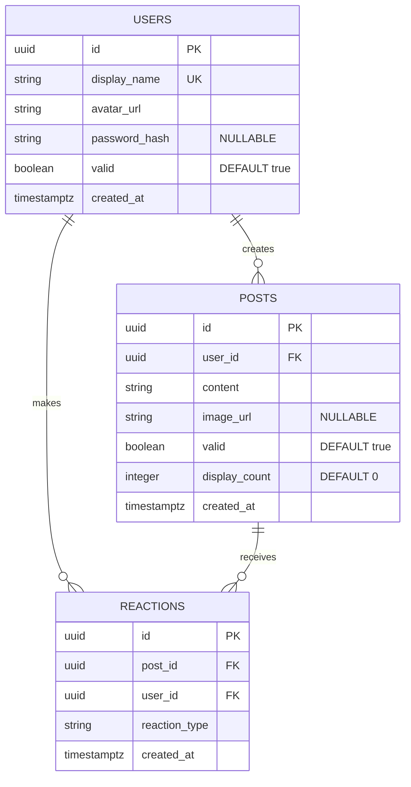

# データベース仕様書

## 概要

Echoプロジェクトのデータベース設計仕様書です。承認欲求ゼロの匿名SNSというコンセプトに基づき、投稿の自動削除、匿名性、反応機能を実現しています。

## ER図



---

## テーブル定義

### 1. USERS テーブル

#### 概要
ユーザーの基本情報を管理します。ユーザー名（display_name）はユーザーが設定し、アバターはランダム生成されます。オプションで認証情報を持つことができます。

#### カラム定義

| カラム名 | 型 | 制約 | デフォルト値 | 説明 |
|---------|-----|------|-------------|------|
| `id` | UUID | PRIMARY KEY, NOT NULL | - | ユーザーID |
| `display_name` | VARCHAR(255) | UNIQUE, NOT NULL | - | ユーザー名兼表示名（ユニーク） |
| `avatar_url` | TEXT | NOT NULL | - | ランダム生成されるアバター画像URL |
| `password_hash` | TEXT | NULLABLE | NULL | ハッシュ化されたパスワード（オプション） |
| `valid` | BOOLEAN | NOT NULL | true | ソフトデリートフラグ |
| `created_at` | TIMESTAMPTZ | NOT NULL | CURRENT_TIMESTAMP | 作成日時 |

#### インデックス

```sql
CREATE UNIQUE INDEX idx_users_display_name ON users(display_name);
```

#### ビジネスルール

- **ユーザー名**: `display_name`はユーザーが自由に設定でき、ログインIDとしても使用される（ユニーク制約）
- **匿名性**: `avatar_url`はランダム生成される
- **認証**: `password_hash`はオプショナルで、認証が必要な場合のみ設定
- **ソフトデリート**: `valid = false`で論理削除

---

### 2. POSTS テーブル

#### 概要
ユーザーの投稿を管理します。表示回数によって自動削除される仕組みを持ちます。

#### カラム定義

| カラム名 | 型 | 制約 | デフォルト値 | 説明 |
|---------|-----|------|-------------|------|
| `id` | UUID | PRIMARY KEY, NOT NULL | - | 投稿ID |
| `user_id` | UUID | NOT NULL, FOREIGN KEY | - | 投稿者のユーザーID |
| `content` | TEXT | NOT NULL | - | 投稿内容（テキスト） |
| `image_url` | TEXT | NULLABLE | NULL | 投稿画像のURL |
| `valid` | BOOLEAN | NOT NULL | true | ソフトデリートフラグ |
| `display_count` | INTEGER | NOT NULL | 0 | 表示回数カウンター |
| `created_at` | TIMESTAMPTZ | NOT NULL | CURRENT_TIMESTAMP | 作成日時 |

#### 外部キー制約

```sql
CONSTRAINT fk_posts_user_id
    FOREIGN KEY (user_id)
    REFERENCES users(id)
    ON DELETE CASCADE
```

#### インデックス

```sql
CREATE INDEX idx_posts_user_id ON posts(user_id);
CREATE INDEX idx_posts_created_at ON posts(created_at);
CREATE INDEX idx_posts_display_count ON posts(display_count) WHERE valid = true;
```

#### ビジネスルール

- **自動削除**: `display_count`が10に達した投稿は自動的に`valid = false`に設定
- **投稿者非表示**: 投稿者は自分の投稿を確認できない（アプリケーション層で制御）
- **ランダム表示**: タイムラインはランダム順で表示される
- **カスケード削除**: ユーザーが削除されると、関連する投稿も削除される

---

### 3. REACTIONS テーブル

#### 概要
ユーザーが投稿に対して行う反応（エコー）を管理します。従来の「いいね」とは異なる5種類の反応をサポートします。

#### カラム定義

| カラム名 | 型 | 制約 | デフォルト値 | 説明 |
|---------|-----|------|-------------|------|
| `id` | UUID | PRIMARY KEY, NOT NULL | - | 反応ID |
| `post_id` | UUID | NOT NULL, FOREIGN KEY | - | 対象投稿のID |
| `user_id` | UUID | NOT NULL, FOREIGN KEY | - | 反応したユーザーのID |
| `reaction_type` | VARCHAR(50) | NOT NULL | - | 反応の種類 |
| `created_at` | TIMESTAMPTZ | NOT NULL | CURRENT_TIMESTAMP | 作成日時 |

#### 外部キー制約

```sql
CONSTRAINT fk_reactions_post_id
    FOREIGN KEY (post_id)
    REFERENCES posts(id)
    ON DELETE CASCADE

CONSTRAINT fk_reactions_user_id
    FOREIGN KEY (user_id)
    REFERENCES users(id)
    ON DELETE CASCADE
```

#### ユニーク制約

```sql
CREATE UNIQUE INDEX idx_reactions_user_post_type
    ON reactions(user_id, post_id, reaction_type);
```

#### インデックス

```sql
CREATE INDEX idx_reactions_post_id ON reactions(post_id);
CREATE INDEX idx_reactions_user_id ON reactions(user_id);
```

#### 反応タイプ（Enum）

| 値 | 説明 | 用途 |
|----|------|------|
| `surprise` | 驚き | 予想外の内容に対する反応 |
| `empathy` | 共感 | 理解・共感を示す |
| `laugh` | 笑い | 面白い内容に対する反応 |
| `sad` | 悲しみ | 悲しい・残念な内容への反応 |
| `confused` | 困惑 | 理解しづらい内容への反応 |

#### ビジネスルール

- **重複制限**: 同一ユーザーは同じ投稿に対して同じ種類の反応を複数回できない
- **カスケード削除**: 投稿またはユーザーが削除されると、関連する反応も削除される
- **承認欲求ゼロ**: 反応は「いいね」ではなく、感情の共有として設計

---

## マイグレーション履歴

### 実行順序

1. **create_users_table** (最初)
   - ユーザーテーブルの作成
   - 基本的なプロフィール情報のみ

2. **create_posts_table**
   - 投稿テーブルの作成
   - `user_id`で USERS テーブルを参照

3. **add_user_credentials**
   - USERS テーブルに認証情報を追加
   - `password_hash`カラムを追加

4. **create_reactions_table** (最後)
   - 反応テーブルの作成
   - POSTS と USERS の両方を参照

### マイグレーション実行コマンド

```bash
# すべてのマイグレーションを実行
cd backend
cargo run --bin migration up

# 特定のマイグレーションまで実行
cargo run --bin migration up -n 2

# ロールバック
cargo run --bin migration down
```

---

## データフロー

### 投稿の作成

```
1. ユーザーが投稿作成
   ↓
2. POSTS テーブルに新規レコード挿入
   - user_id: 投稿者のID
   - display_count: 0
   - valid: true
   ↓
3. 投稿者には表示されない（アプリケーション層で制御）
```

### 投稿の表示と削除

```
1. タイムライン取得リクエスト
   ↓
2. ランダムに有効な投稿を取得
   WHERE valid = true AND display_count < 10
   ↓
3. 各投稿の display_count をインクリメント
   ↓
4. display_count が 10 に達したら valid = false に更新
```

### 反応の登録

```
1. ユーザーが投稿に反応
   ↓
2. REACTIONS テーブルに新規レコード挿入
   - 重複チェック（user_id, post_id, reaction_type）
   ↓
3. 反応が記録される（反応数はREACTIONSテーブルから集計）
```

---

## パフォーマンス考慮事項

### インデックス戦略

- **USERS**
  - `display_name`: 認証時のルックアップ用（ユニーク制約）

- **POSTS**
  - `user_id`: ユーザーの投稿取得用
  - `created_at`: 時系列ソート用
  - `display_count`: 有効投稿のフィルタリング用

- **REACTIONS**
  - `post_id`: 投稿の反応取得用
  - `user_id`: ユーザーの反応履歴取得用
  - `(user_id, post_id, reaction_type)`: 重複防止用

### クエリ最適化

```sql
-- ランダムなタイムライン取得（パフォーマンス考慮版）
SELECT * FROM posts
WHERE valid = true
  AND display_count < 10
ORDER BY random()
LIMIT 20;

-- 投稿の表示カウント更新
UPDATE posts
SET display_count = display_count + 1,
    valid = CASE WHEN display_count + 1 >= 10 THEN false ELSE true END
WHERE id = $1;

-- 反応数の集計
SELECT reaction_type, COUNT(*) as count
FROM reactions
WHERE post_id = $1
GROUP BY reaction_type;
```

---

## セキュリティ考慮事項

### パスワードハッシュ化

- **アルゴリズム**: bcrypt推奨
- **コスト**: 12以上
- **実装**: Rustの`bcrypt` crateを使用

```rust
use bcrypt::{hash, verify, DEFAULT_COST};

// ハッシュ化
let password_hash = hash("user_password", DEFAULT_COST)?;

// 検証
let valid = verify("user_password", &stored_hash)?;
```

### SQL インジェクション対策

- SeaORM の ORM 機能により自動的にパラメータ化されたクエリが生成される
- 生SQL使用時は必ずプレースホルダーを使用

### 個人情報保護

- `display_name`はユーザーが自由に設定可能
- `avatar_url`はランダム生成される
- パスワードは必ずbcryptでハッシュ化して保存

---

## バックアップ戦略

### 推奨バックアップ方法

```bash
# 日次フルバックアップ
pg_dump -U postgres -d echo_db -F c -f backup_$(date +%Y%m%d).dump

# リストア
pg_restore -U postgres -d echo_db backup_20250101.dump
```

### 保持ポリシー

- 日次バックアップ: 7日間保持
- 週次バックアップ: 4週間保持
- 月次バックアップ: 12ヶ月保持

---

## 拡張性

### 将来的な拡張案

1. **タグ機能**
   - `TAGS` テーブル追加
   - `POST_TAGS` 中間テーブルで多対多関係

2. **通知機能**
   - `NOTIFICATIONS` テーブル追加
   - 反応時の通知（ただし承認欲求を刺激しないよう配慮）

3. **レポート機能**
   - `REPORTS` テーブル追加
   - 不適切な投稿の報告

4. **画像メタデータ**
   - `image_width`, `image_height`カラム追加
   - サムネイル最適化

---

## データ保持ポリシー

- **投稿**: `display_count`が10に達したら論理削除（`valid = false`）
- **反応**: 投稿が削除されたらカスケード削除
- **ユーザー**: アカウント削除時は物理削除ではなく論理削除を推奨

---

## 参考情報

### 技術スタック

- **ORM**: SeaORM 0.12+
- **データベース**: PostgreSQL 15+
- **マイグレーション**: SeaORM CLI

### ドキュメント

- [SeaORM Documentation](https://www.sea-ql.org/SeaORM/)
- [PostgreSQL Documentation](https://www.postgresql.org/docs/)

---

**更新日**: 2025-01-07
**バージョン**: 1.0.0
